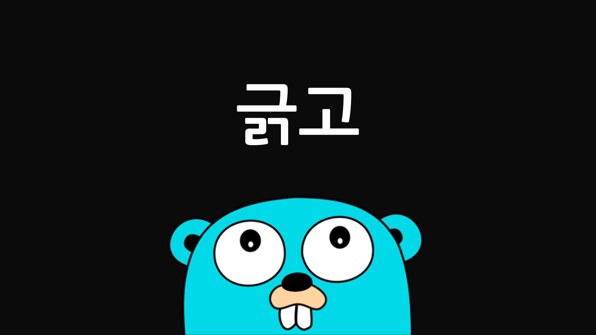

  
# 긁고(Geulk-go)

긁고(Geulk-go)는 Go 언어로 개발된 CLI 프로젝트입니다. 이 프로젝트는 Examtopics.com 웹사이트의 데이터를 크롤링하는 기능을 제공합니다. 고루틴(goroutine)의 개념을 실제로 적용해보고 성능을 비교해보기 위해 시작되었습니다.

## 주요 기능

- `listproviders`: Examtopics에서 제공하는 시험 프로바이더 목록을 표시합니다.
- `listexams`: 특정 프로바이더의 시험 목록을 표시합니다.
- `savediscussions`: 특정 시험의 Discussions 링크를 텍스트 파일로 저장합니다.
- `saveexam`: 시험 내용(문제, 선지, 답안)을 PDF 파일로 저장합니다.

## 사용 방법

```
Usage:
  listproviders
  listexams -provider PROVIDER
  savediscussions -provider PROVIDER -exam EXAMCODE
  saveexam -import FILENAME -export FILENAME
```

## 기능 연계

`savediscussions` 기능을 사용하여 저장된 .txt 파일은 `saveexam` 기능의 import 파일로 사용할 수 있습니다. 이를 통해 토론 링크를 먼저 저장한 후, 해당 링크들을 바탕으로 시험 내용을 PDF로 저장하는 두 단계 프로세스를 수행할 수 있습니다.

## 빌드 방법

1. Go가 설치되어 있는지 확인합니다. (https://golang.org/doc/install)
2. 프로젝트를 클론합니다:
   ```
   git clone https://github.com/caputdraconis050630/geulk-go.git
   cd geulk-go
   ```
3. 의존성을 설치합니다:
   ```
   go mod tidy
   ```
4. 프로젝트를 빌드합니다:
   ```
   go build -o geulk-go
   ```
5. 빌드된 실행 파일을 실행합니다:
   ```
   ./geulk-go [command] [flags]
   ```

## 기술 스택

- *Only **Go***

## 주의사항

이 프로젝트는 개인 학습 목적으로만 사용되어야 합니다. 상업적 이용은 금지됩니다. 프로젝트와 관련하여 문제가 발생할 경우, GitHub 프로필에 기재된 연락처로 연락 주시기 바랍니다.
